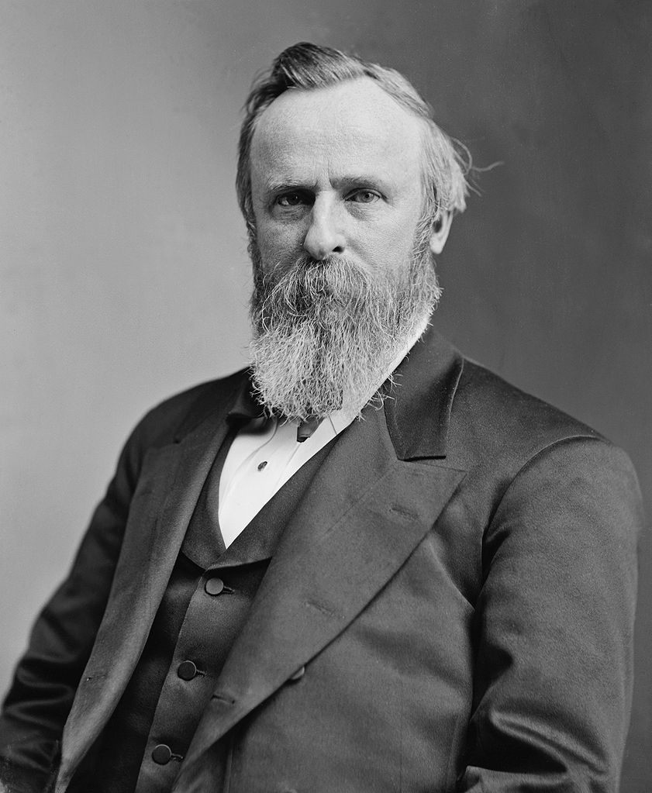

GET benchmark results (50000 runs)

```
        Rate   lwp  mojo  tiny  furl  curl
lwp    639/s    --  -46%  -74%  -93%  -96%
mojo  1180/s   85%    --  -52%  -86%  -92%
tiny  2484/s  288%  110%    --  -71%  -84%
furl  8651/s 1253%  633%  248%    --  -44%
curl 15385/s 2306% 1204%  519%   78%    --
```

GET benchmark (~100k jpg response) (50000 runs)

```
       Rate   lwp  mojo  tiny  furl  curl
lwp   564/s    --  -33%  -69%  -87%  -92%
mojo  841/s   49%    --  -53%  -80%  -88%
tiny 1808/s  221%  115%    --  -57%  -75%
furl 4205/s  646%  400%  133%    --  -42%
curl 7236/s 1183%  760%  300%   72%    --
```

The payload is this handsome image of the 19th President of the United States, 
[Rutherford B. Hayes](http://en.wikipedia.org/wiki/Rutherford_B._Hayes).



Start the PSGI server for this benchmark by using `starman app-big-response.psgi`

POST benchmark results (50000 runs)

```
        Rate   lwp  mojo  tiny  furl  curl
lwp    655/s    --  -41%  -68%  -90%  -94%
mojo  1112/s   70%    --  -46%  -84%  -90%
tiny  2058/s  214%   85%    --  -70%  -82%
furl  6868/s  949%  518%  234%    --  -39%
curl 11211/s 1612%  909%  445%   63%    --
```

